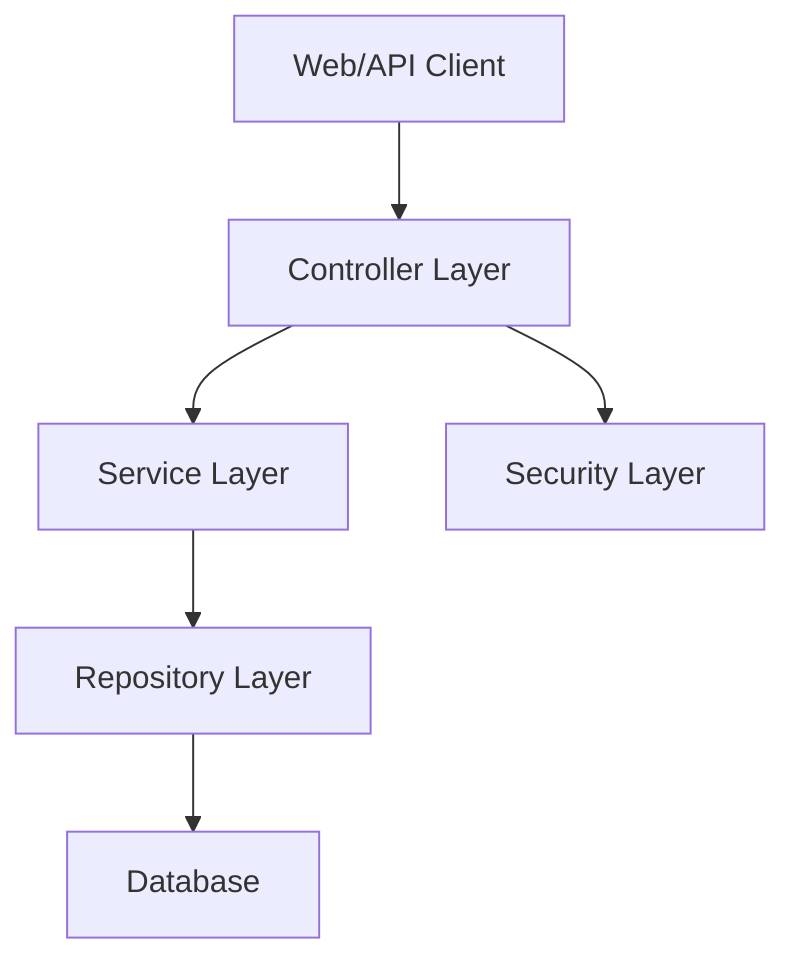
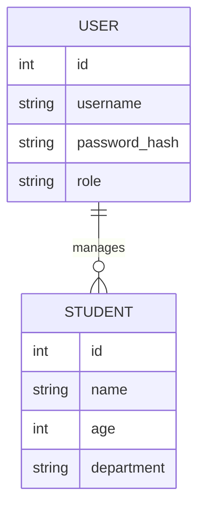

# SDP-2200030709

A comprehensive documentation for the repository **BachamManoj/SDP-2200030709**. This project appears to be an implementation related to Student Data Processing (SDP), featuring user authentication, database interactions, and RESTful APIs. The following sections provide a deep dive into the architecture, setup, usage, and contributions.

---

## Table of Contents

- [Overview](#overview)
- [Installation](#installation)
- [Configuration](#configuration)
- [Project Structure](#project-structure)
- [Features](#features)
- [Usage Guide](#usage-guide)
- [API Documentation](#api-documentation)
- [Code Architecture](#code-architecture)
- [Database Schema](#database-schema)
- [Testing](#testing)
- [Troubleshooting](#troubleshooting)
- [Contributing](#contributing)
- [License](#license)
- [Contact](#contact)

---

## Overview

SDP-2200030709 is a student data processing system built with a focus on secure authentication and efficient data management. The project uses Java with Spring Boot, REST APIs, and JDBC for database connectivity. The repository is designed for academic and organizational use, allowing CRUD operations on student data.

---

## Installation

Follow these steps to set up the project locally:

- Clone the repository:
  ```bash
  git clone https://github.com/BachamManoj/SDP-2200030709.git
  ```
- Navigate to the project directory:
  ```bash
  cd SDP-2200030709
  ```
- Build the project using Maven:
  ```bash
  mvn clean install
  ```
- Set up your database (see [Configuration](#configuration)).
- Run the application:
  ```bash
  mvn spring-boot:run
  ```

---

## Configuration

Before running the application, configure your database connection:

- Edit `src/main/resources/application.properties`:
  - Set database URL, username, and password.
  - Example for MySQL:
    ```
    spring.datasource.url=jdbc:mysql://localhost:3306/sdp_db
    spring.datasource.username=yourUsername
    spring.datasource.password=yourPassword
    spring.datasource.driver-class-name=com.mysql.cj.jdbc.Driver
    spring.jpa.hibernate.ddl-auto=update
    ```

---

## Project Structure

The repository is organized as follows:

- `src/main/java/com/sdp/` – Java source files.
  - `controller/` – API controllers for handling requests.
  - `model/` – Data models representing entities.
  - `repository/` – Database access layers (DAOs).
  - `service/` – Business logic and service classes.
  - `config/` – Security and application configuration.
- `src/main/resources/` – Configuration files and static assets.
- `pom.xml` – Maven build configuration.

---

## Features

- User authentication with login and registration.
- RESTful API endpoints for student data management.
- CRUD operations on student records.
- Database integration using JDBC and JPA.
- Error handling and validation.

---

## Usage Guide

### User Actions

- **Register**: Create a new user account.
- **Login**: Authenticate and access protected resources.
- **View Students**: Fetch student data via API endpoints.
- **Add/Edit/Delete**: Perform CRUD operations (requires correct permissions).

### Example Workflow

1. Register as a new user.
2. Login with credentials.
3. Use your session token (JWT or session) to access further endpoints.

---

## API Documentation

### User Registration Endpoint (POST /register)

#### Register a New User

```api
{
    "title": "User Registration",
    "description": "Register a new user with a username and password.",
    "method": "POST",
    "baseUrl": "http://localhost:8080",
    "endpoint": "/register",
    "headers": [
        {
            "key": "Content-Type",
            "value": "application/json",
            "required": true
        }
    ],
    "queryParams": [],
    "pathParams": [],
    "bodyType": "json",
    "requestBody": "{\n  \"username\": \"john_doe\",\n  \"password\": \"securePass123\"\n}",
    "formData": [],
    "responses": {
        "201": {
            "description": "User registered successfully",
            "body": "{\n  \"message\": \"Registration successful\"\n}"
        },
        "409": {
            "description": "User already exists",
            "body": "{\n  \"error\": \"Username already taken\"\n}"
        }
    }
}
```

### User Login Endpoint (POST /login)

#### Authenticate User and Receive Token

```api
{
    "title": "User Login",
    "description": "Authenticate user and receive a JWT token.",
    "method": "POST",
    "baseUrl": "http://localhost:8080",
    "endpoint": "/login",
    "headers": [
        {
            "key": "Content-Type",
            "value": "application/json",
            "required": true
        }
    ],
    "queryParams": [],
    "pathParams": [],
    "bodyType": "json",
    "requestBody": "{\n  \"username\": \"john_doe\",\n  \"password\": \"securePass123\"\n}",
    "formData": [],
    "responses": {
        "200": {
            "description": "Login successful",
            "body": "{\n  \"token\": \"JWT_TOKEN_HERE\"\n}"
        },
        "401": {
            "description": "Invalid credentials",
            "body": "{\n  \"error\": \"Invalid username or password\"\n}"
        }
    }
}
```

### Get All Students Endpoint (GET /students)

#### Retrieve Student Data

```api
{
    "title": "Get All Students",
    "description": "Retrieve a list of all students. Requires authentication.",
    "method": "GET",
    "baseUrl": "http://localhost:8080",
    "endpoint": "/students",
    "headers": [
        {
            "key": "Authorization",
            "value": "Bearer <token>",
            "required": true
        }
    ],
    "queryParams": [],
    "pathParams": [],
    "bodyType": "none",
    "requestBody": "",
    "formData": [],
    "responses": {
        "200": {
            "description": "List of students",
            "body": "[\n  {\n    \"id\": 1,\n    \"name\": \"Alice\",\n    \"age\": 20\n  },\n  {\n    \"id\": 2,\n    \"name\": \"Bob\",\n    \"age\": 21\n  }\n]"
        },
        "401": {
            "description": "Unauthorized",
            "body": "{\n  \"error\": \"Authentication required\"\n}"
        }
    }
}
```

---

## Code Architecture

The application uses a layered architecture for separation of concerns:



- **Controller Layer**: Handles HTTP requests and responses.
- **Service Layer**: Contains business logic and validation.
- **Repository Layer**: Interacts with the database.
- **Security Layer**: Manages authentication and authorization.

---

## Database Schema

The application uses a relational database schema to store users and students.



- **USER**: Stores user credentials and roles.
- **STUDENT**: Stores student information.

---

## Testing

To run tests, use:

```bash
mvn test
```

- Unit tests cover controllers, services, and repositories.
- Integration tests validate API endpoints and data flows.

---

## Troubleshooting

- Ensure your database is running and credentials are correct.
- Check `application.properties` for correct configuration.
- Use logs for debugging errors.
- Verify dependencies in `pom.xml` are correctly installed.

---

## Contributing

We welcome contributions!

- Fork the repository.
- Create a new branch for your feature or bugfix.
- Commit changes and push to your fork.
- Submit a Pull Request with a clear description.

---

## License

This project is licensed under the MIT License. See the `LICENSE` file for more details.

---

## Contact

For questions, contact the repository owner via GitHub issues or email.

---

```card
{
    "title": "Quick Start",
    "content": "Clone the repo, configure your database, and run the application to get started."
}
```
